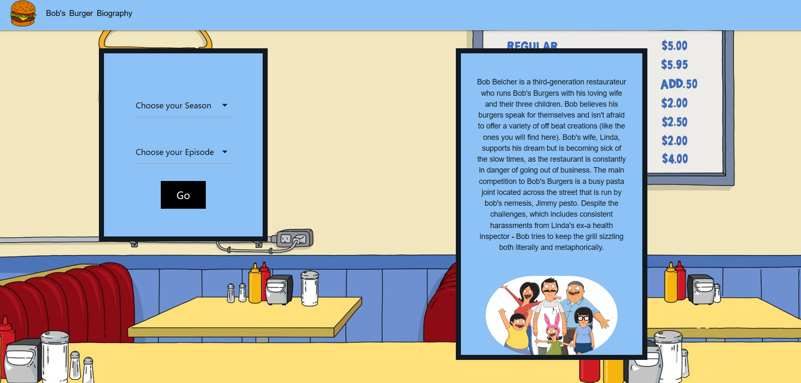

# Bob's Burgers of the Day

## Description

The motivation behind this group project was to create a page that displays the individual ratings of each episode/season in Bob’s Burgers along with the name of that individual burger of the day. It used https://www.bobsburgersapi.com/documentation#burger-of-the-day to request the title (ex- “Foot Feta-ish Burger”), price, and end credits sequence image from https://www.bobsburgersapi.com/documentation#end-credits-sequence. The ratings of each episode were requested from https://imdb-api.com/api/#Ratings-header. Once those API's were fetched, we displayed them in container that populates once the input (season/episode) was given by the user. After that was completed, we were to deploy this live application to GitHub pages. 

In this specific challenge, our group used everything we’ve learned over the past six modules to create a real-world front-end application that we will be able to showcase to potential employers in the future. The user story and acceptance criteria were created by us, but the project must fulfill a set of requirements.

## User Story

As a Bob’s Burgers Fan
I want to filter episodes/seasons 
So that I can view the individual ratings on IMDb (IMDb) in unison with the individual burger of the day for each episode (title/price end credit image).

## Requirements

- Use a CSS framework other than Bootstrap
- Be deployed to GitHub Pages.
- Be interactive (i.e., accept and respond to user input).
- Use at least two server-side APIs.
- Does not use alerts, confirms, or prompts (use modals).
- Use client-side storage to store persistent data.
- Be responsive.
- Have a polished UI.
- Have a clean repository that meets quality coding standards (file structure, naming conventions, follows best practices for class/id naming conventions, indentation, quality comments, etc.).
- Have a quality README (with unique name, description, technologies used, screenshot, and link to deployed application).

## Installation

To get this project installed you can find the core code at https://github.com/joshbaileydev513/bobs-burgers-project . From there, click the green <>Code dropdown button and copy the HTTPS or SSH link within Clone. Once you have that copied, open up your CLI or GitBash and run the following commands:

git clone (paste your HTTPS or SSH link)

Or you can view the live page here: https://joshbaileydev513.github.io/bobs-burgers-project/

## Usage

- As you load you page you have two boxes, one on the left side and one on the right side. The box on the left has two dropdown boxes, the top one says "Choose your Season" and the bottom one says "Choose your Episode". 
- The box on the right side has a short description of the show and a small picture of the bob's burger family. The user selects the season and the episode they want from the dropdown box. 
- After they select that and click the go button the box on the right will show the user all the burgers of the day that were in that episode. 
- It will also show the price of the burgers, the imDb rating of that episode, and a snapshot picture of the ending credit sequence. 
- If there was no burger of the day for that episode it will show the user "No burger of the Day". They can select another episode using the dropdown boxes or click the burger on the top left corner to reset the page.

Additionally, you can find the live page at this link: https://joshbaileydev513.github.io/bobs-burgers-project/

## Credits

All credits to both of our instructors Jack and Jay who have been a huge help during this project so far. Additional credits to both our API's (IMDb API/Bob's Burgers API) for the information used and materialize for the styling. 

## License

Please refer to the LICENSE in the repo.